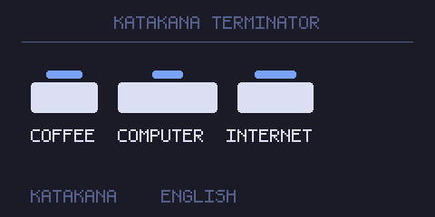

# 片假名终结者 · Katakana Terminator for BetterNCM

在网易云音乐里，给**片假名外来语**上方标注**英文原词**

```
コンピューターの前に座って、コーヒーを飲む
  computer              coffee
```



## 环境

- 网易云音乐 **2.10.x / 3.x**（在 3.1.39 上实测）
- [BetterNCM](https://github.com/BetterNCM) **1.3.0+**

## 安装

从 [Releases](../../releases) 下载 `katakana-terminator.plugin`，放进 BetterNCM 的插件目录（通常是 `C:\betterncm\plugins`）后重启网易云；插件市场里搜「片假名终结者」也行

## 说明

- 英文原词来自内置的**离线词典**（335 条），词典里没有的词可以联网校正；设置里关掉就完全离线
- 含汉字的歌词行默认整个让给 [jp-furigana](https://github.com/Leleawa/jp-furigana)（它给汉字标振假名），纯假名行归本插件；想在同一行里两种注音都看到，先给它打共存补丁：`npm run patch:furigana`
- 三个注音插件（jp-furigana / 本插件 / [拉丁字母片假名注音](https://github.com/YXLEI0/latin-katakana-betterncm)）可以同时开着，互不打架
- 桌面歌词无效，那是原生窗口而不是网页
- 设置项全表、共存补丁的五处改动、翻译从哪来、排障、实现要点、已知限制见 [docs/notes.md](docs/notes.md)

## 许可

插件自身的代码采用 **MIT** 协议，见 [LICENSE](LICENSE)

打包分发的第三方组件与数据来源见 [NOTICE.md](NOTICE.md)
